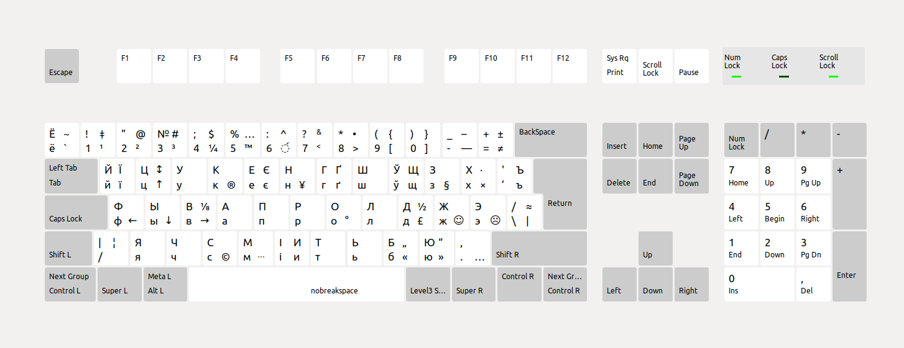

# Беларуская друкарская клавіятура для Linux.



Зроблена паводле [артыкула](https://anibyl.livejournal.com/23657.html).

## Усталяванне

Для ўсталявання раскладкі вам трэба запусціць тэрмінал у гэтай дырэкторыі і запусціць наступную каманду:

```bash
chmod +x ./install.sh
./install.sh install
```

Затым, вам спатрэбіцца перазагрузіць камп’ютар і выбраць раскладку ў наладах.

## Выдаленне

Калі ў вас узніклі праблемы, вы можаце вярнуць канфігурацыйныя файлы ў былы стан камандай

```bash
./install.sh backup
```

Пасля гэтага, будзе патрэбна перазагрузка прылады.
